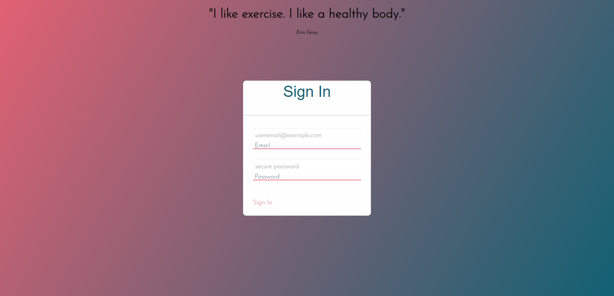
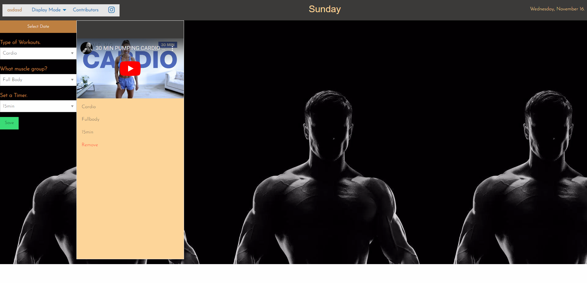
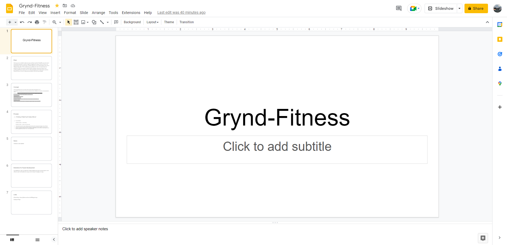

# Grynd-App Project

## User-Story
As a user I want to be able to plan and modify my daily or weekly workouts to achieve my fitness goals. 

## Acceptance-Criteria
GIVEN log in page I can see a quote and submit my email to have it displayed on the Grynd-app

WHEN I log in to the app

THEN I can see my information displayed
   
GIVEN log in page I can see a quote and submit my email to have it displayed on the Grynd-app

WHEN I log in to the app

THEN I can see my information displayed

WHEN I choose a day of the week

THEN it is displayed I am presented with more options about workout types and muscle groups to excersize

WHEN I click submit button

THEN a dynamic card is generated with the information the user inputs along with a youtube video fitness guide.

## Purpose 
Have you ever needed to plan out your workout routines? Feel like you just never know what workouts or what to target throughout the week? Fear no more, the grynd-fitness app can generate a workout planner for you depending on the users daily/weekly goals. This revolutionary app allows the user to create cards for whichever day of the week in which feature youtube sponsored videos from professional fitness trainers that can help and guide you through these routines. Grynd-Fitness is here to help you personalize and meet your goals!

This is a fitness app that allows the user to plan out their workout routines throughout the week.

## Usage
This application features foundation framework, jquery, jqueryui, fonstastic, and two server API's from youtube and API ninja's. A responsive layout using foundation framework has also
been implimented to adjust to multiple screen sizes. 

## Contributors
[Jonathan Perez](https://github.com/jon-dev092)
[Cristina Geremia]()
[Carlos Martinez](https://github.com/ch4r1i3?tab=repositories)
[Myles Nichols](https://github.com/MylesNichols?tab=repositories)

## Links
[Deployed Page]()
[Github Repo](https://github.com/jon-dev092/grynd-app)
[Google slides](https://docs.google.com/presentation/d/1VuReWAWcQrk-9wUzu8zkGsEd2sIWNwdDpG99fbPqlWQ/edit#slide=id.p)

