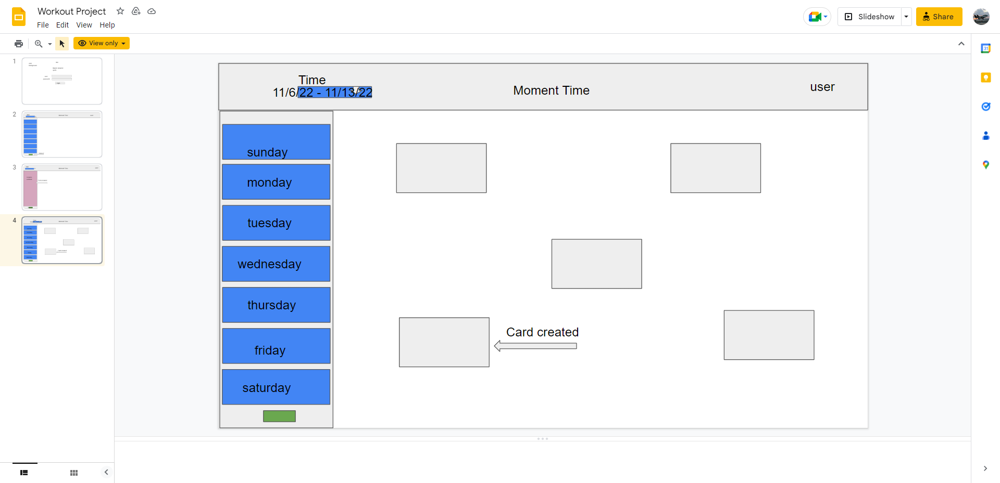

# Grynd-App Project

## User-Story
As a user I want to be able to track and modify my daily workouts to achieve my fitness goals. 

## Acceptance-Criteria
GIVEN log in page I can submit my name and have it displayed on the Grynd-app.

WHEN I choose a day of the week

THEN I am presented with a form to choose workout types and lengths that are logged and displayed on the screen

WHEN I click the 'weekly' dropdown I can view previously logged workouts

THEN I can begin my workout with a timer to track my progress

## Wireframe

[Wireframe site](https://docs.google.com/presentation/d/1pEXKMuA6Fylk4uxW2pN34GunoDKNCb5jfK7jLyi3LxA/edit?usp=sharing)

